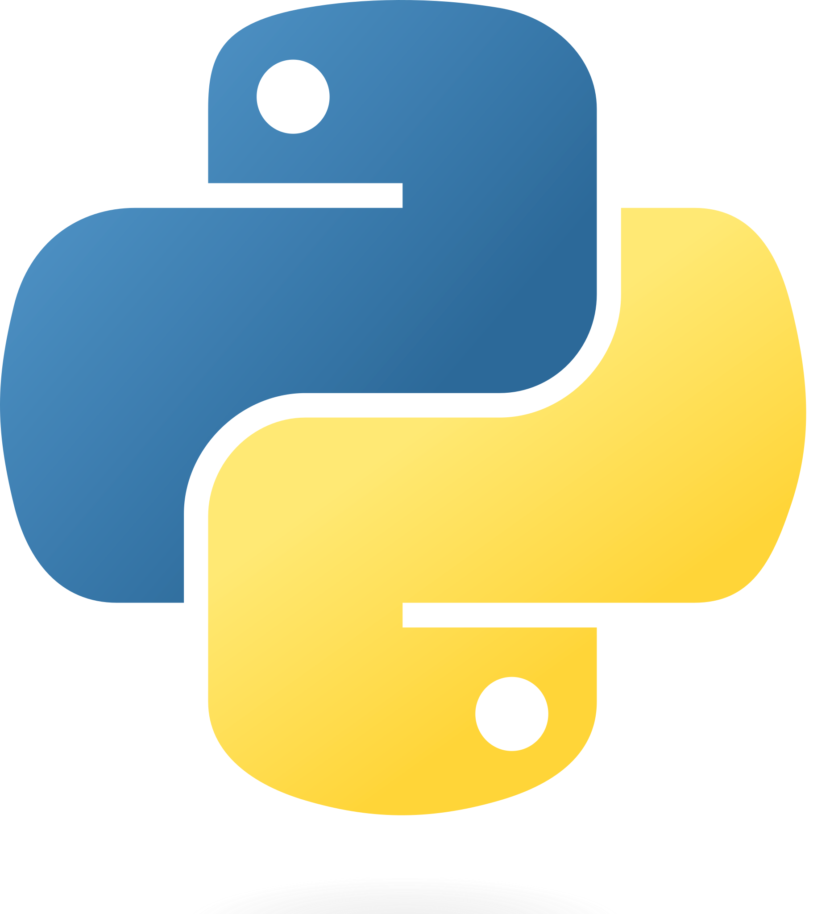
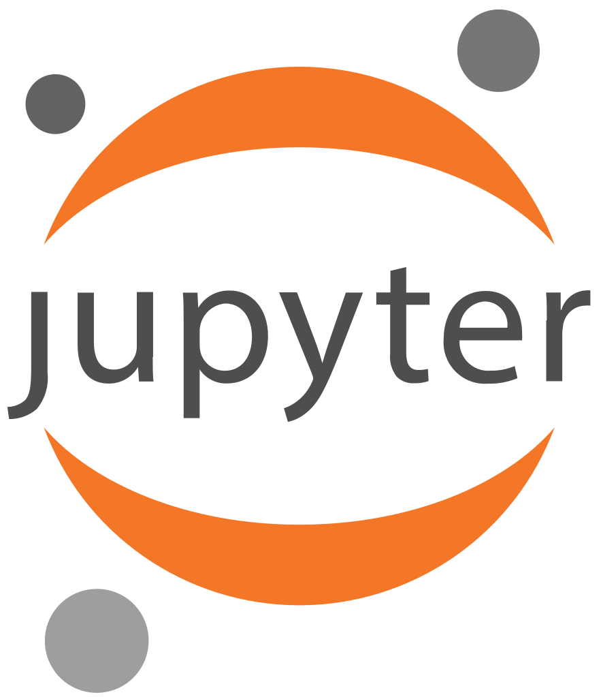

# Introducción a Python

## ¿Qué es Python?

::: {.columns}
:::: {.column width=50%}

**Python** es un lenguaje **interpretado** de **alto nivel**.
Es un lenguaje **multiparadigma** ya que soporta **orientación a objetos**, **programación imperativa** y, en menor medida, **programación funcional**.
Es un lenguaje **dinámicamente tipado** y **multiplataforma**.

- **No compilado**: Interpretado
- **Alto nivel**: Fácil y abstracto
- **Dinámicamente tipado**: Variables no están sujetas a un tipo (*nombres*)
- **IA**: numpy, pandas, scikit-learn, tensorflow, etc.

<https://python.org/>

::::
:::: {.column width=50%}

{width=80% fig-align="center"}

::::
:::


## Motivación

Python es el lenguaje de programación más popular: \url{https://spectrum.ieee.org/top-programming-languages-2024}.


::: {.columns}
:::: {.column width=50%}

### Pros

- Fácil de aprender
- Código compacto y entendible
- Ampliamente utilizado (cuenta con amplio soporte)
- Muchas librerías

::::
:::: {.column width=50%}

### Cons

- Muy alto nivel
- Lento (comparado con C)
- No es fuertemente tipado

::::
:::

## Usos

**Python** es usado en muchos campos, como:

- **Análisis de datos**: Pandas, Numpy, etc.
- **Inteligencia Artificial**: Machine Learning, Deep Learning, etc.
- **Desarrollo web**: Django, Flask, etc.
- **Automatización**: Scripts, bots, etc.
- **Industria**: Automatización, IoT, etc.
- **Juegos**: Pygame, Panda3D, etc.
- etc.


# Entorno

## Instalación

Existen diversas formas de trabajar con Python, que dependen del entorno que se quiera utilizar, del uso que se le vaya a dar, y del sistema operativo.

- **Local**: Instalación en tu propio ordenador
    - **Anaconda**: Distribución de Python que incluye librerías y entorno de desarrollo.
    - **pip**: Instalador de paquetes de Python.
- **Online**: Plataformas online como Google Colab, Jupyter Notebook, etc.


## Intérprete

Python es un lenguaje interpretado, lo que significa que el código se ejecuta línea a línea.
Se puede utilizar Python como un **intérprete interactivo** donde se ejecuta una línea de código a la vez.

``` {python}
#| output: true
print("Hello World!")
```

Esto se suele hacer desde una terminal de comandos:

``` {.bash}
python
```

## Fichero python

El uso más común de Python es escribir un *script* en un fichero con extensión `.py`.
Estos ficheros se ejecutan a través del intérprete de Python, que lee el código línea a línea y lo ejecuta.

``` {python}
#| output: true
# Fichero: hello.py
s = "Hello World!"
print(s)
```

Para ejecutar el fichero, se hace desde la terminal:

``` {.bash}
python hello.py
```

## Jupyter Notebook

::: {.columns}
:::: {.column width=50%}

Jupyter Notebook es un formato de documento que permite combinar texto y gráficos con código Python.
Esta es la herramienta más extendida en el ámbito de la ciencia de datos y el machine learning.

- **Interactivo**: Se ejecuta celda a celda
- **Visual**: Muestra gráficos y texto
- **Exportable**: A HTML, PDF, etc.

::::
:::: {.column width=50%}

{width=50% fig-align="center"}

::::
:::

## Google Colab

::: {.columns}
:::: {.column width=50%}

Google Colab es una plataforma gratuita de Google que permite ejecutar cuadernos de Jupyter en la nube.
Esto tiene muchas ventajas;

- **Notebook**: trabaja por defecto con cuadernos de Jupyter
- **Online**: no requiere de instalación ni actualización
- **Nube**: es independiente del dispositivo (no dará problemas de hardware ni compatibilidad)
- **Dependencias**: incluye muchas librerías preinstaladas con las mismas versiones para todos los usuarios


::: {.callout-important}
Esta es la plataforma recomendada para el curso.
:::

::::
:::: {.column width=50%}

{width=80% fig-align="center"}

::::
:::


# Bases del lenguaje

## Variables

Las variables en Python son **dinámicamente tipadas**, lo que significa que no se especifica el tipo de variable al declararla.

``` {python}
#| output: true
x = 5       # int
y = "Hello" # str
print(x, y)
```

## Asignación

Se asigna un valor a una variable con el operador `=`.

``` {python}
#| output: true
x = 5  # x is 5
y = x  # y is 5
x = 3  # x is 3
a, b = x, 2 # a is 3, b is 2
print(x, y, a, b)
```

## Comentarios

Todo lo escrito detrás de un `#` o entre `"""` es un comentario y no se ejecuta.

``` {python}
#| output: true
x = 5
# This is a comment
# x = 3
""" x = 2 """
print(x)
```


## Tipos de datos

Python tiene varios tipos de datos básicos:

- **Numéricos**: `int`, `float`
- **Texto**: `str`
- **Booleanos**: `bool`
- **Secuencias**: `list`, `tuple`
- **Conjuntos**: `set`
- **Diccionarios**: `dict`

``` {python}
#| output: true
x = 5       # int
y = 5.0     # float
z = "Hello" # str
print(type(x), type(y), type(z))
```

## Casting

Se puede cambiar el tipo de una variable con *casting*.

``` {python}
#| output: true
x = 5       # int
y = str(x)  # str
print(y, type(y))
```

## Operadores aritméticos

``` {python}
#| output: true
x = 5   # int
y = 2   # int
print(x + y)  # Add
print(x - y)  # Subtract
print(x * y)  # Multiply
print(x / y)  # Divide
print(x % y)  # Modulus
print(x ** y) # Exponentiation
print(x // y) # Floor division
```

## Operadores lógicos

``` {python}
#| output: true
x = True   # bool
y = False  # bool
print(not x)   # Not
print(x and y) # And
print(x or y)  # Or
```

`0`, string vacío, lista vacía, etc. son considerados `False` en Python.

``` {python}
#| output: true
x = 0   # int -> False
y = ""  # str -> False
print(bool(x), bool(y))
```

## Operadores de comparación

``` {python}
#| output: true
x = 5  # int
y = 2  # int
print(x == y) # Equal
print(x != y) # Not equal
print(x > y)  # Greater than
print(x >= y) # Greater than or equal
print(x < y)  # Less than
print(x is y) # Same object
```

# Tipos de datos

## Listas

Las listas son una colección ordenada y mutable de elementos.

``` {python}
#| output: true
l = [1, 2, 3, 4, 5]  # list
print(l)
```

## Listas - Acceso a elementos

Para acceder a un elemento de una lista, se utiliza el operador `[]`.

``` {python}
#| output: true
l = [1, 2, 3, 4, 5]
print(l[0])   # First element
print(l[-1])  # Last element
print(l[1:3]) # Slice [2,3]
```

## Listas - Modificación

Los elementos en las listas se pueden modificar accediendo mediante `[]`.
Las listas también pueden ampliarse `append` y sumarse `+`.

``` {python}
#| output: true
l = [1, 2]  # list
print(l)
l[0] = 0    # l = [0,2]
print(l)
l.append(3) # l = [1,2,3]
print(l)
l = l + l   # l = [1,2,3,1,2,3]
print(l)
```


## Tuplas

Las tuplas son una colección ordenada e inmutable de elementos.
Se accede a ellas como a las listas, pero no se pueden modificar.

``` {python}
#| output: true
t = (1, 2, 3, 4, 5)
print(t)
print(t[1:3])
```

## Sets

Los sets (o conjuntos) son una colección desordenada y mutable de elementos únicos.
No se puede acceder a los elementos salvo por iteración, pero se pueden añadir y eliminar elementos.

``` {python}
#| output: true
s = {1, 2, 3, 4, 5}
print(s)
s.add(6)
print(s)
s.add(6)
print(s)
s.remove(1)
print(s)
```

## Diccionarios

Los diccionarios son una colección no ordenada de pares clave-valor.

``` {python}
#| output: true
d = {"a": 1, "b": 2, "c": 3}
print(d)
print(d["a"])
d["a"] = 0
print(d)
```

## Strings

Los strings son tuplas de caracteres con métodos específicos.

``` {python}
#| output: true
s = "Hello World!"
print(s)
print(s[0])
print(s[1:5])
```

## String - Métodos

``` {python}
#| output: true
s = "Hello World!"
print(s.upper())
print(s.lower())
print(s.replace("H", "J"))
print(s.split(" "))
print(s.find("W"))
```


# Control de flujo

## Bloques

Los bloques de código en Python se definen por la indentación (espacios y tabuladores al principio de la línea).
Por eso, es muy importante mantener la indentación correcta.

``` {python}
#| output: true
if True:
    print("Bloque 1")
    if False:
        print("Bloque 2")
print("Bloque 3")
```


## Condicionales

Los condicionales en Python se realizan con `if`, `elif` y `else`.

``` {python}
#| output: true
x = 5
if x > 5:
    print("Mayor que 5")
elif x < 5:
    print("Menor que 5")
else:
    print("Igual a 5")
```

## Bucle while

El bucle `while` se ejecuta mientras la condición sea verdadera.

``` {python}
#| output: true
x = 0
while x < 5:
    print(x)
    x += 1
```

## Bucle for

El bucle `for` se utiliza para iterar sobre una secuencia.

``` {python}
#| output: true
l = [1, 2, 3, 4, 5]
for x in l:
    print(x)
```

## Bucle for - range

La función `range` genera una secuencia de números.

``` {python}
#| output: true
for x in range(5):
    print(x)
```

## Operadores de bucle

El operador `break` se utiliza para salir de un bucle.
El operador `continue` se utiliza para saltar a la siguiente iteración.

``` {python}
#| output: true
for x in range(5):
    if x % 2:
        continue
    if x == 4:
        break
    print(x)
```


# Funciones

## Librerías

Python tiene una gran cantidad de librerías que se pueden importar y utilizar.
Para importar se usa la palabra clave `import`.
Se puede renombrar la librería con `as`.

``` {python}
#| output: true
import numpy        # To use numpy use numpy.function()
import numpy as np  # To use numpy use np.function()
```

## Funciones

Las funciones en Python se definen con la palabra clave `def`.
Estas sirven para encapsular código y reutilizarlo.

``` {python}
#| output: true
def my_function():
    print("Hello from a function")

my_function()
my_function()
```

## Funciones - Argumentos

Las funciones pueden tener argumentos que se pasan al llamar a la función.
Los argumentos pueden usarse por posición o por nombre.
También se pueden definir argumentos por defecto, que se usan si al llamar a la función no se especifican.

``` {python}
#| output: true
def my_function(name, age=25):
    print(f"Hello {name}, you are {age} years old")

my_function("Alice")
my_function(age=30, name="Bob")
```


## Funciones - Retorno

Las funciones pueden devolver un valor con la palabra clave `return`.

``` {python}
#| output: true
def my_function(x):
    return x * 2

print(my_function(3))
print(my_function(5))
```


## Built-in functions

Estas son algunas de las funciones integradas en Python que se utilizan con frecuencia:

- `print`: Imprime por pantalla
- `range`: Devuelve un iterable con una secuencia de números
- `len`: Devuelve la longitud de un iterable o contenedor

- `input`: Lee por teclado
- `sum`: Devuelve la suma de los elementos de un iterable
- `min`: Devuelve el mínimo de los elementos de un iterable
- `max`: Devuelve el máximo de los elementos de un iterable
- `any`: Devuelve `True` si algún elemento de un iterable es `True`
- `all`: Devuelve `True` si todos los elementos de un iterable son `True`
- `sorted`: Devuelve una lista ordenada de los elementos de un iterable


# Clases

## Clases

Para crear estructuras de datos más complejas, se pueden utilizar clases.
La palabra clave `class` se utiliza para definir una clase.

``` {python}
#| output: true
class MyClass:
    x = 5

c = MyClass()
print(c.x)
```

## Clases - Métodos

Las clases pueden tener métodos, que son funciones que pertenecen a la clase.
El primer argumento de un método es el objeto que lo llama, por convención se llama `self`.

``` {python}
#| output: true
class MyClass:
    def my_method(self):
        print("Hello from a method")

c = MyClass()
c.my_method()
```

## Clases - built-in methods

Existen varios métodos especiales que se pueden definir en una clase:

- `__init__`: Constructor de la clase
- `__str__`: Representación en string de la clase
- `__len__`: Longitud de la clase
- `__getitem__`: Acceso a elementos a través de `[]`
- etc.


# Avanzado

## List comprehension

`List comprehension` es una forma rápida y compacta de crear listas.

``` {python}
#| output: true
l1 = [x for x in range(5)]
print(l1)

l2 = [x for x in range(5) if x % 2]
print(l2)
```

## Lambda

`Lambda` es una forma de definir funciones anónimas en una sola línea.

``` {python}
#| output: true
f = lambda x: x * 2
print(f(3))

# Sort by second element
l = [(1, 2), (3, 1), (5, 3)]
l.sort(key=lambda x: x[1])
```

## Enumerate

`enumerate` es una función que devuelve un iterable con índices y valores.

``` {python}
#| output: true
l = ["a", "b", "c"]
for i, x in enumerate(l):
    print(i, x)
```

## Trabajar con diccionarios

Los diccionarios se pueden recorrer por clave, valor o ambos.

``` {python}
#| output: true
d = {"a": 1, "b": 2, "c": 3}
for k in d.keys():
    print(k)

for v in d.values():
    print(v)

for k, v in d.items():
    print(k, v)
```

## Iterar sobre más de un valor

Se pueden crear bucles que iteren sobre más de un iterable a la vez, cuando el iterable es una colección.
La función `zip` crea un iterable que agrupa los elementos de los iterables que se le pasan.

``` {python}
#| output: true
l1 = [1, 2, 3]
l2 = ["a", "b", "c"]
for x, y in zip(l1, l2):
    print(x, y)
```

## Herencia

La herencia es una característica de la programación orientada a objetos que permite crear una nueva clase a partir de una clase existente.

``` {python}
#| output: true
class Parent:
    def __init__(self, x):
        self.x = x

class Child(Parent):
    def __init__(self, x, y):
        super().__init__(x)
        self.y = y

c = Child(1, 2)
print(c.x, c.y)
```

## Mucho más

El lenjuaje Python es muy extenso y tiene muchas más características y funcionalidades.
En este tema se ha hecho un resumen básico de las ideas principales del lenguaje y los elementos más utilizados.

Animamos a los estudiantes a explorar más sobre el lenguaje y a profundizar en las áreas que más les interesen.

{width=30% fig-align="center"}
